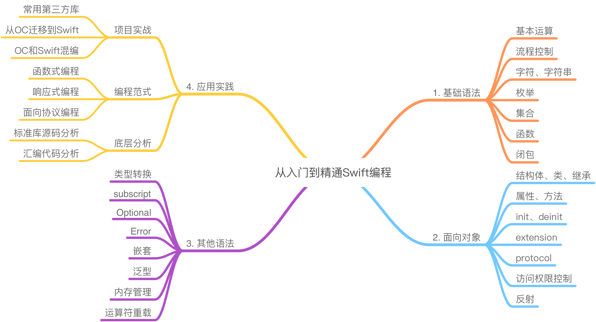

# Swift-Study

It's my Swift-study respository

## Swift-官网学习

### Swift-基础部分

### Swift-运算符

### Swift-字符串和字符

### Swift-集合类型

### Swift-控制流

### Swift-函数

### Swift-闭包

### Swift-枚举

### Swift-属性

### Swift-方法

### Swift-下标

### Swift-继承

### Swift-构造过程

### Swift-析构过程

### Swift-可选链

### Swift-错误处理

### Swift-类型转换

### Swift-嵌套类型

### Swift-扩展

### Swift-协议

### Swift-泛型

### Swift-自动引用计数

### Swift-内存安全

## 站在汇编角度深入学习Swift

### 思维导图

### 01-Playground

[Playground](站在汇编角度深入学习Swift/01-Playground/Playground.md)

### 02-注释

[注释](站在汇编角度深入学习Swift/ 02-注释/注释.md)

### 03-常量

[常量](站在汇编角度深入学习Swift/03-常量/常量.md)

### 04-标识符_数据类型

[标识符_数据类型](站在汇编角度深入学习Swift/04-标识符_数据类型/标识符_数据类型.md)

### 05-字面量

[字面量](站在汇编角度深入学习Swift/05-字面量/字面量.md)

### 06-类型转换

[类型转换](站在汇编角度深入学习Swift/06-类型转换/类型转换.md)

### 07-元组

[元组](站在汇编角度深入学习Swift/07-元组/元组.md)

### 08-流程控制

#### if_while_for

[if_while_for](站在汇编角度深入学习Swift/08-流程控制/if_while_for.md)

#### 区间类型

[区间类型](站在汇编角度深入学习Swift/08-流程控制/区间类型.md)

#### switch

[switch](站在汇编角度深入学习Swift/08-流程控制/switch.md)

### 09-函数

#### 函数

[函数](站在汇编角度深入学习Swift/09-函数/函数.md)

#### 输入输出参数(In-Out Parameter)

[输入输出参数(In-Out Parameter)](站在汇编角度深入学习Swift/09-函数/输入输出参数(In-Out Parameter).md)

#### 函数重载

[函数重载](站在汇编角度深入学习Swift/09-函数/函数重载.md)

#### 内联函数

[内联函数](站在汇编角度深入学习Swift/09-函数/内联函数.md)

#### 函数类型

[函数类型](站在汇编角度深入学习Swift/09-函数/函数类型.md)

#### @inline

[@inline](站在汇编角度深入学习Swift/09-函数/@inline.md)

#### 嵌套函数

[嵌套函数](站在汇编角度深入学习Swift/09-函数/嵌套函数.md)

### 10-枚举

[枚举](站在汇编角度深入学习Swift/10-枚举/枚举.md)

#### 原始值内存布局

[原始值内存布局](站在汇编角度深入学习Swift/10-枚举/原始内存布局.md)

#### 可选项

[可选项](站在汇编角度深入学习Swift/10-枚举/可选项.md)

#### 强制解包

[强制解包](站在汇编角度深入学习Swift/10-枚举/强制解包.md)

#### guard语句

[guard语句](站在汇编角度深入学习Swift/10-枚举/guard语句.md)

#### 隐式解包

[隐式解包](站在汇编角度深入学习Swift/10-枚举/隐式解包.md)

### 11-思考下面枚举变量的内存布局

[思考下面枚举变量的内存布局](站在汇编角度深入学习Swift/11-思考下面枚举变量的内存布局/思考下面枚举变量的内存布局.md)

#### 汇编语言

[汇编语言](站在汇编角度深入学习Swift/11-思考下面枚举变量的内存布局/汇编语言.md)

