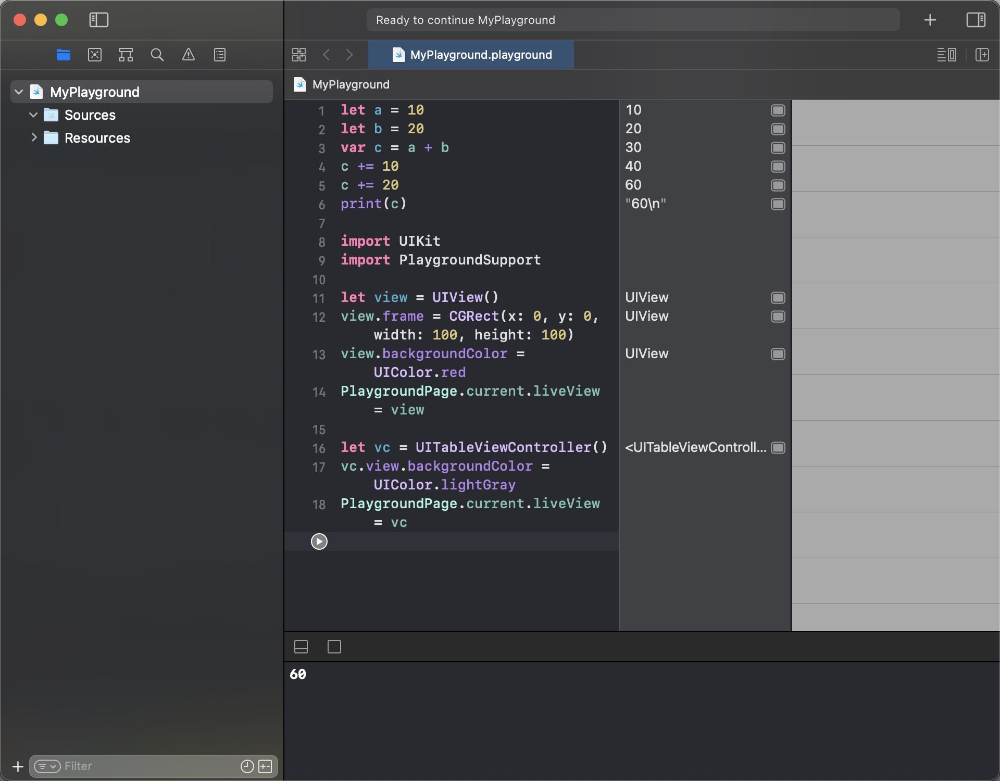

# Playground

Playground可以快速浏览代码效果。

## 创建方式

### 创建方式一

点击 File -> 点击 New -> 点击 Playground

### 创建方式二

XCode版本: 12.x
快捷键: command + shift + option + N

## 在Playground中展示UI样式方法

### 引入相关库

``` swift

import UIKit
import PlaygroundSupport

```

其中"UIKit"为UI库，"PlaygroundSupport"为playground展示UI样式使用的库。

### 实例代码

``` swift

let a = 10
let b = 20
var c = a + b
c += 10
c += 20
print(c)

import UIKit
import PlaygroundSupport

let view = UIView()
view.frame = CGRect(x: 0, y: 0, width: 100, height: 100)
view.backgroundColor = UIColor.red
PlaygroundPage.current.liveView = view

```

快捷键 command+shift+Enter 运行结果如下


同理也可以展示图片、视图控制器等其

展示 TableViewController 实例代码

``` swift

let vc = UITableViewController()
vc.view.backgroundColor = UIColor.lightGray
PlaygroundPage.current.liveView = vc

```



