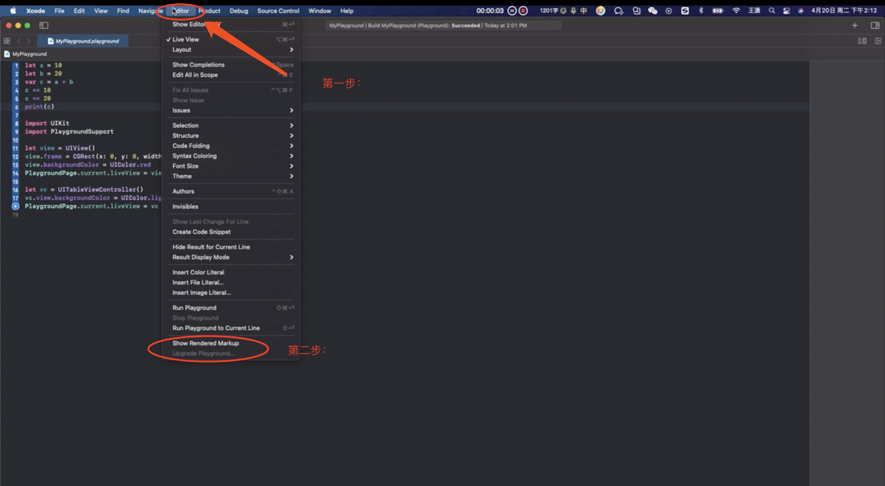
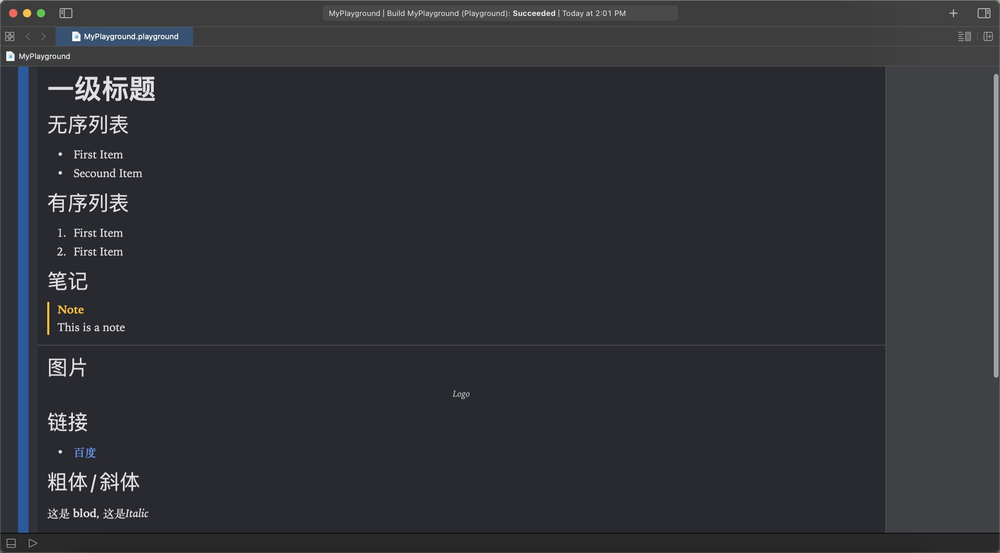

# 注释

## 单行注释

``` swift
//	我是一条注释语句
```

## 多行注释

``` swift

/*
	我
	是
	一
	条
	多
	行
	注
	释
*/

```

## swift支持嵌套注释

``` swift

/* 我
	 是
	 外
	 层
	 注
	 释
	/*
		我
		是
		内
		层
		注
		释
	*/
*/

```

## markup语法

+ 只有在Playground的注释支持markup语法(与markdown相似)

+ 开启markup渲染效果(如下图所示)



开启后如下图所示



### 上一页和下一页

playground里面跳转

``` swift
/*
  上一页(@previous)
  下一页(@next)
*/
```