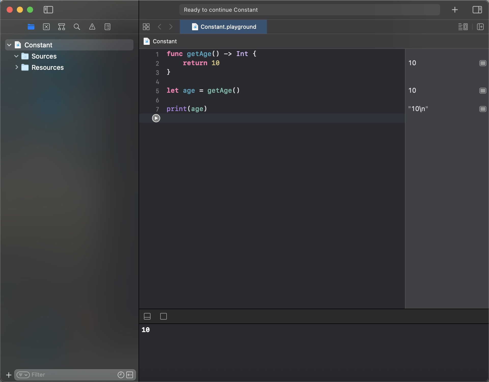
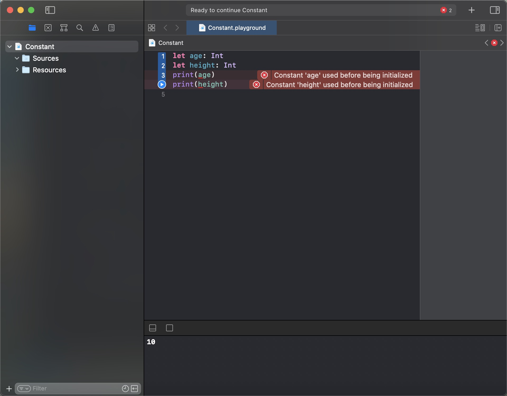

# 常量

+ 常量只能进行赋值一次
+ 且swift中不要求在编译时期确定，但使用之前必须赋值一次

``` swift

func getAge() -> Int {
    return 10
}

let age = getAge()

print(age)

```

运行结果如下：



+ 常量、变量在初始化之前，都不能使用



报错信息：

```
Constant 'age' used before being initialized
Constant 'height' used before being initialized
```

意思就是：age 和 height 在使用之前没有进行初始化