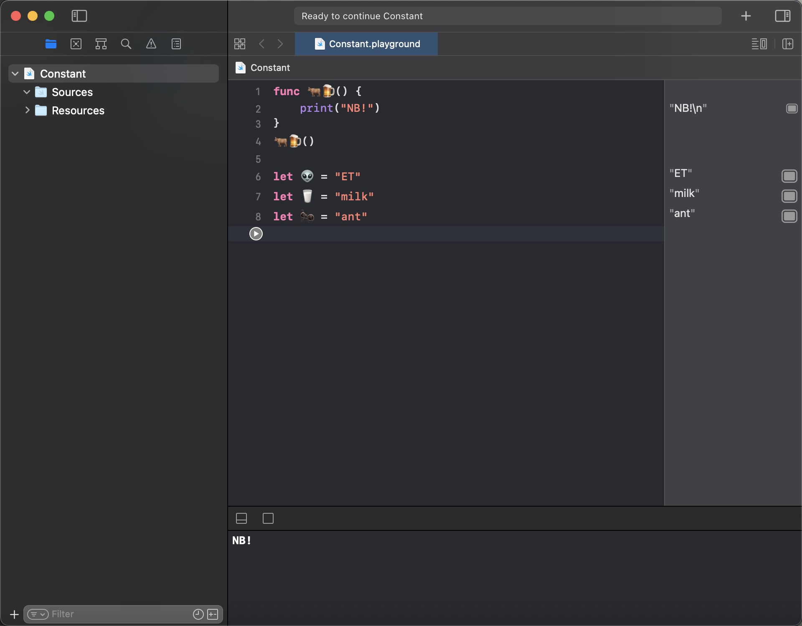

# 标识符_数据类型


## 标识符

+ 标识符(常量、变量、函数名)几乎可以使用任何字符
+ 标识符不能以数字开头，不能包含空白字符串、制表符、箭头等特殊字符

实例代码



## 数据类型

- 值类型
	- 枚举(enum) : Optional
	- 结构体(struct): Bool、Int、Float、Double、Character、String、Array、Dictionary、Set
- 引用类型
	- 类(class)

### 枚举(enum)

枚举: 一个变量可能有多个取值。

``` swift

enum peopleKill {
    case cook
    case drink
    case sleep
    case study
    case work
}

var kill = peopleKill.work

switch kill {
case .cook:
    print("I can cook")
case .drink:
    print("I can drink")
case .sleep:
    print("I can sleep")
case .study:
    print("I can study")
case .work:
    print("I can work")
}

```

### Dictionary(字典)

字典：一个值对应一个键(Key)。 [KeyType: ValueType]()

** 实例代码 **

``` swift

var dict = [Int: String]()
dict = [1:"one", 2:"two", 3:"three", 4:"four", 5:"five", 6:"six", 7:"seven"];

//	访问字典
var first = dict[1]

//	修改字典
//	使用updateValue(forkey:)方法
dict.updateValue("one的新值", forkey: 1)

```

### Set与Array区别

1. Array是数组，特点是有序。Set是集合，特点是无序。
2. Array数组里面的元素可以是重复的。Set里面的元素不可以有重复的元素。
3. Array可以通过索引进行访问。Set不能通过索引访问。
4. Array通过append方法可以在数组的尾部和头部添加元素。

实例代码

``` swift

var newArray = [1, 2, 3, 4, 5, 6];
var newSet :Set<Int> = [1, 2, 3, 4, 5, 6];
var newSet2 :Set<Int> = [2, 3, 5, 6];

//  访问元素
print(newArray[0])
print(newSet)   //  不可以通过索引访问

//  插入元素
newArray.append(7)

//  删除元素
//  删除第一个元素
newArray.removeFirst()
//  删除最后一个元素
newArray.removeLast()
//  删除指定位置的元素
newArray.remove(at: 0)
//  删除全部元素
newArray.removeAll()

//  Array更新元素
newArray[1] = 3
print(newArray)

//  Set添加元素
newSet.insert(9)
newSet.insert(2)   //   添加失败,因为集合里面已经存在了数字"2"

//  Set删除元素
newSet.remove(2)
print(newSet)
//  Set删除所有元素
newSet.removeAll()

//  集合的交集/合集/子集
newSet.intersection(newSet2)

newSet.union(newSet2)

newSet.subtracting(newSet2)


```