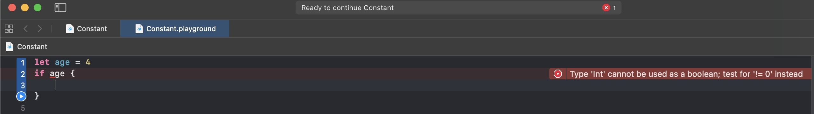

# if_while_for

## if-else

``` swift

let age = 4
if age >= 22 {
	print("Get married")
} else if age >= 18 {
	print("Being a adult")
} else if age >= 7 {
	print("Go to school")
} else {
	print("Just a child")
}

```

+ if后面的条件可以省略小括号
+ 条件后面的大括号不可以省略

**注意** if后面的条件只能是Bool类型,否则会报错



``` Type 'Int' cannot be used as a boolean; test for '!= 0' instead ```

大概意思为：Int类型不能当作bool类型来使用，可以尝试添加 != 0 代替

## while

``` swift

var num = 5
while num > 0 {
	print("num is \(num)")
	num -= 1
}//	打印了5次

var num = -1

repeat {
	print("num is \(num)")
} while num > 0 //	打印了1次

```

+ repeat-while 相当于C语言中的do-while
+ 这里不使用 ```num -- ``` 是因为从Swift3开始，去除了自增(++)、自减(--)运算符

## for

``` swift

for _ in 0...3 {
	print("123")
}

```