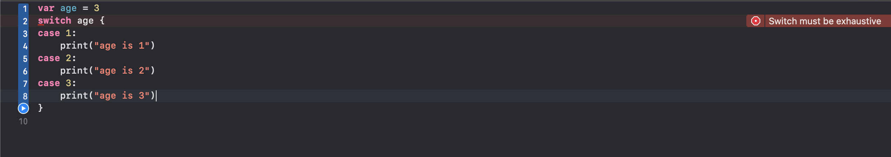

# switch

``` swift

var age = 3
switch age {
case 1:
    print("age is 1")
case 2:
    print("age is 2")
case 3:
    print("age is 3")
default:
    break
}


```

+ switch中可以不写break，并不会因此贯穿到后面的条件。
+ 如果想要贯穿到后面，可以使用fallthrough
+ switch必须要保证能处理所有情况



否则会报错 ``` Switch must be exhaustive ```

大致意思为:switch必须要详尽。

+ case、default后面至少要有一条语句
+ 如果不想做任何事，价格break即可

## 注意点

+ 如果已经处理完所有情况后,也就不必使用default了。

``` swift

enum Answer = { case right, wrong }
let answer = Answer.right
switch answer {
case Answer.right:
	print:("right")
case Answer.wrong:
	print("wrong")
}

```

## 复合条件

``` swift

let string = 'Jack'
switch string {
case "Jack":
	fallthrough
case "Rose":
	print("Right person")
}
default:
	break
	
	
switch string {
case "Jack", "Rose":
	print("Right person")
}
default:
	break
```

## 区间匹配、元组匹配

### 区间匹配

``` swift

let count = 30
switch count {
case 0...10:
    print("The number range is 0-10")
case 11...20:
    print("The number range is 11-20")
case 21...30:
    print("The number range is 21-30")
default:
    print("dont't konw the number range")
}

```

### 元组匹配

``` swift

let point = (1, 1)
switch point {
case (0, 0):
    print("the origin")
case (_, 0):
    print("on the x-axis")
case (-2...-2, -2...-2):
    print("outinside pf the box")
default:
    print("outside of the box")
}

```

## 值绑定

``` swift

let point = (2, 0)
switch point {
case (let x, 0) :
	print("on the x-axis with an value of \(x)")
case (0, let y):
	print("on the y-axis with a y value of \(y)")
case let (x, y):
	print("someWhere else at (\(x), \(y))")
}

```

## where

where就是加条件的意思，有点类似过滤的意思。


``` swift

var numbers = [10, 20, -10, -20, 30, -30]
var sum = 0

for num in numbers where num > 0 {
    sum += num
}

print(sum)

```

## 标签语句

``` swift

outer:for i in 1...4 {
    for k in 1...4 {
        if k == 3 {
            continue outer
        }
        if i == 3 {
            break outer
        }
        print("i == \(i), k == \(k)")
    }
}

```

上面代码翻译：通过两个for循环嵌套 当 k== 3的时候，结束本次循环，并从最外层for循环执行下一次的循环。当 i == 3的时候，立即停止并终止外部循环。