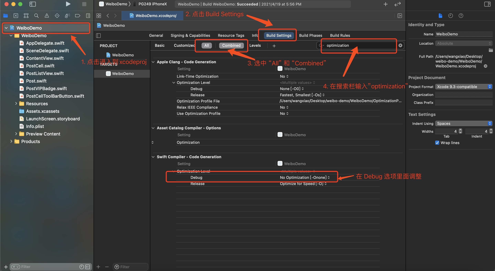

# 内联函数

+ 如果开启了编译器优化( Release模式默认会开起优化)，编译器会自动将某些函数变成内联函数

检测是否开起的步骤图片



+ 将函数调用展开成函数体

代码示例

``` swift

func test() {
	print("test")
}

test()	//	断点不会进入

```

以上代码在test() 函数调用处打上断点，断点并不会进入，而是直接展开成函数体代码

``` swift

print("test");

```

+ 内联函数可以减少函数调用的开销，不用开辟栈空间和回收栈空间。

## 哪些函数不会被内联

+ 函数体比较长
+ 包含递归调用
+ 包含动态派发