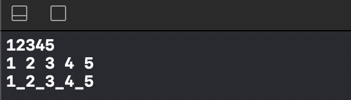

# 函数

## 函数定义

``` swift

func pi() -> Double {
    return 3.14
}
func sum(v1: Int, v2: Int) -> Int {
    return v1 + v2
}
sum(v1: 10, v2: 20)
//  形参默认是let，也只能是let

```

+ 形参默认是let，也只能是let

+ 无返回值

``` swift

func sayHello() -> Void {
	print("Hello")
}

func sayHello() -> () {
	print("Hello")
}

func sayHello() {
    print("Hello");
}

sayHello()

```

### 隐示返回

+ 如果函数体是一个单一表达式，那么函数会隐示返回这个表达式

``` swift

func sum(v1: Int, v2: Int) -> Int {
	v1 + v2
}

sum(v1: 10, v2: 20)	//	30

```

### 返回元组：实现多返回值

``` swift

func calculate(v1: Int, v2: Int) -> (sum: Int, difference: Int, average: Int) {
    let sum = v1 + v2
    return (sum, v1 - v2, sum >> 1)
}

let result = calculate(v1: 20, v2: 10)
result.sum
result.difference
result.average

```

代码疑惑点： sum >> 1 为啥为平均值了？这里使用的是位运算，向右移动一位。等于给左边加一个0.演示如下：

``` 
1. sum的值为30,转换为二进制 0001 1110
2. 将sum右移动1位为：0000 1111
3. 1111转换为10进制为：15

```

### 函数的文档注释

实例代码

``` swift

/// 求和【概述】
///
/// 将2个整数相加【更详细的描述】
///
/// - Parameter v1: 第一个整数
/// - Parameter v2: 第二个整数
/// -   Returns: 2个整数的和
///
/// - Note:传入2个整数即可【批注】
///

func sum(v1: Int, v2: Int) -> Int { v1 + v2 }
sum(v1: 10, v2: 20)

```

按住"option" 移动到函数sum上效果图如下图所示


### 参数标签( Argument Label)

实例代码

``` swift

func goToWork(at time: Stirng) {
	print("this time is \(time)")
}

goToWork(at: "08:00")
//	this time is 08:00

```

其中的time相当于对at参数的一个解释，这个函数为什么时间去上班，有了参数标签后方便理解。

可以使用_ 省略参数标签

``` swift

func sum(_ v1: Int, _ v2: Int) -> Int {
	v1 + v2
}
sum(10, 20)

```

### 默认参数值

参数可以有默认值

``` swift

func check(name: String = "nobody", age: Int, job: String = "none") {
	print("name=\(name), age=\(age), job=\(job)")
}
check(age: 15)	//	name=nobody, age=15, job=none

```

### 可变参数

``` swift

func sum(_ numbers: Int...) -> Int {
    var total = 0
    for number in numbers {
        total += number
    }
    return total
}
sum(10, 20, 30, 40) //  100

```

**注意点**

+ 一个函数最多只能有1个可变参数
+ 紧跟在可变参数后面的参数不能省略参数标签

``` swift
//	参数string不能省略标签
func test(_ numbers: Int..., string: String, _ other: String) { }
test(10, 20, 30, string: "Jack", "Rose")
```

### swift自带的printf函数

+ separator

可以理解成"分离"函数，因为print函数打印出来自带空格，如果传入参数为""则不分离。如果传入其他参数，比如_，则以_为分割符分割开。他默认是空格是分隔开。

``` swift

print(1, 2, 3, 4, 5, separator:"");
print(1, 2, 3, 4, 5)
print(1, 2, 3, 4, 5, separator:"_");

```



+ terminator

可以理解成print打印的时候，不进行换行展示。

``` swift

print("My name is Jake.", terminator: "")
print("My age is 18.", terminator:"")
print("I'm the boy.")

```

