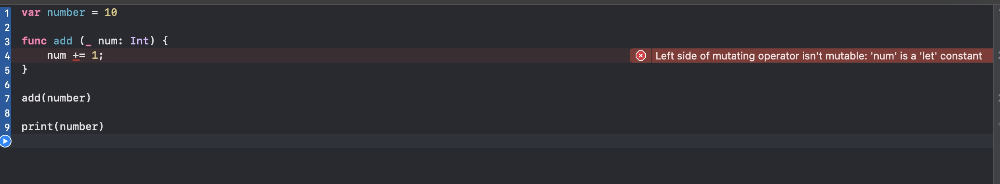
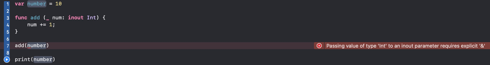

# 输入输出参数(In-Out Parameter)

+ 可以用inout定义一个输入输出参数：可以在函数内部修改外部实参的值。

## 抛砖引玉

``` swift

var number = 10

func add(_ num: Int = 10) {
	num += 1
}

add(number)

```

类似上面代码函数内部给数字+1，此时传入外部参数number会报错。



报错信息

```
Left side of mutating operator isn't mutable: 'num' is a 'let' constant
```

大致意思：

左边的可变操作符是不可变的，num是一个let常量。

修改以上代码

``` swift

var number = 10

func add(_ num: inout Int) {
	num += 1
}

add(&number)

```

就可以执行了，其中传参的时候 必须要添加**&** 否则会报错



``` 
Passing value of type 'Int' to an inout parameter requires explicit '&'
```

大致意思为：向inout参数传递“Int”类型的值需要显式的“&”。

## 应用例子

更换两个变量的值

``` swift

func swapValues(_ v1: inout Int, _ v2: inout Int) {
    let tmp = v1
    v1 = v2
    v2 = tmp
}
var num1 = 10
var num2 = 20
swapValues(&num1, &num2)

```

## 注意点

+ 可变参数不能标记为inout
+ inout参数不能有默认值
+ inout参数的本质是地址传递( 引用传递 )
+ inout参数只能传入可以被多次赋值的。