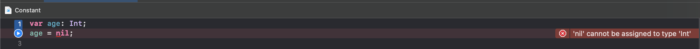

# 可选项

+ 可选项，它允许将值设置为nil
+ 在类型名称后面加个问号？来定义一个可选项

## 抛砖引玉

实例代码

``` swift

var age: Int;
age = nil;

```

以上代码给age赋值，会报错。



```
'nil' cannot be assigned to type 'Int'
```

大致意思为：nil不能赋值给Int类型

``` swift

var age: Int?
age = 10
age = nil

var array = [1, 15, 40, 29]
func get(_ index: Int) -> Int? {
    if index < 0 || index >= array.count {
        return nil
    }
    
    return array[index]
}

print(get(1))	//	Optional(15)
print(get(-1))	//	nil
print(get(4))	//	nil
```

在类型名称后面加个问号？来定义一个可选项，可以赋值为nil
以上数组的索引在小于0或者大于数组长度，则会返回nil，否则返回数组对应的数字。