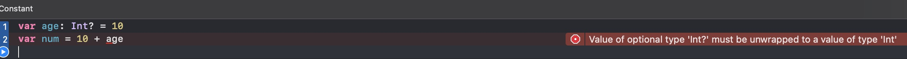
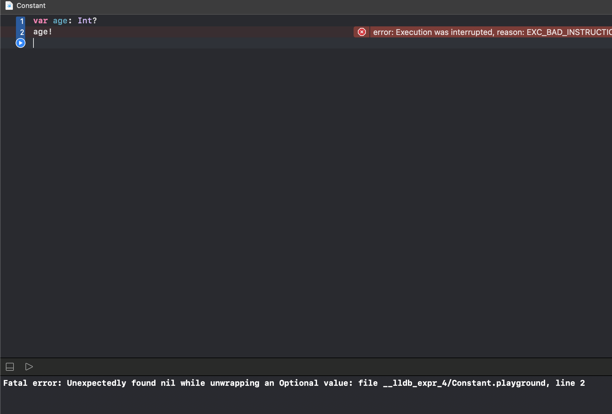

# 强制接包

+ 可选项是对其他类型的一层包装，可以将它理解为一个盒子
+ 如果为nil，那么它是个空盒子
+ 如果不为nil，那么盒子里面装的是：被包装类型的数据
+ 如果要从可选项中取出被包装的数据(将盒子里装的东西取出来),需要感叹号!进行强制解包

``` swift

var age: Int? //	默认就是nil
age = 10
age = nil

var age: Int? = 10
let ageInt: Int = age!
ageInt += 10

```

``` swift
var age: Int? = 10
var num = 10 + age
```

如以上代码，没有进行强制解包就会报错，报错如下



```
Value of optional type 'Int?' must be unwrapped to a value of type 'Int'
```

大致意思为：可选类型的值'Int?'必须被打开为'Int'类型的值

所以把以上的代码报错部分解包，需要使用感叹号。所以修改为：

``` swift
var age: Int? = 10
var num = age! + 20
```

如果对没有进行初始化值的可选项进行强制解包，将会产生运行时错误。

``` swift
var age: Int?
age!
```



```Unexpectedly found nil while unwrapping an Optional value```

大致意思为：在解包的时候意外发现这个值为nil。

## 判断可选项是否包含值

``` swift

let number = Int("123")
if number != nil {
    print("字符串转换整数成功:\(number!)")
} else {
    print("字符串转换整数失败")
}

```

## 可选项绑定(Optional Binding)

+ 可以使用可选项绑定来判断可选项是否包含值
+ 如果包含就自动解包，把值赋给一个临时的常量(let)或者变量(var),并返回true,否则返回false

``` swift

if let number = Int("123") {
    print("字符串转换成功: \(number)")
    //  number是强制解包之后的Int值
    //  number作用域仅限于这个大括号
} else {
    print("字符串转换成整数失败")
}
//  字符串转换整数成功:123

```

``` swift

enum Season: Int {
    case spring = 1, summer, autumn, winter
}

if let season = Season(rawValue: 6) {
    switch season {
    case .spring:
        print("the season is spring")
    default:
        print("the season is other")
    }
} else {
    print("no such season")
}
//  no such season

```

## while循环中使用可选项绑定

``` swift

//	遍历数组，将遇到的正数都加起来，如果遇到负数或者非数字，停止遍历
var strs = ["10", "20", "30", "abc", "-20", "30"]


var index = 0
var sum = 0
while let num = Int(strs[index]), num > 0 {
    sum += num
    index += 1
    print("sum= \(sum)")
}
print(sum)	//	60

```

## 空合并运算符??(Nil-Coalescing Operator)

``` a ?? b ```

a 是可选项
b 是可选项 或者 不是可选项
b 跟 a 的存储类型必须相同
如果 a 不为 nil，就返回 a
如果 a 为 nil,  就返回 b
如果 b 不是可选项，返回 a 时会自动解包

``` swift

let a: Int? = 1
let b: Int? = 2
let c = a ?? b // c是Int?, Optional(1)

let a: Int? = nil
let b: Int? = 2
let c = a ?? b	//	c是Int?, Optional(2)

let a: Int? = nil
let b: Int? = nil
let c = a ?? b	//	c是Int? , nil

let a: Int? = 1
let b: Int = 2
let c = a ?? b	//	c是Int, 1	a是自动解包为1

let a: Int? = nil
let b: Int = 2
//	如果不是用?? 运算符
let c: Int
if let tmp = a {
	c = tmp
} else {
	c = b
}

```

### 多个 ?? 一起使用

``` swift

let a: Int? = 1
let b: Int? = 2
let c = a ?? b ?? 3 //	c是Int, 1

let a: Int? = nil
let b: Int? = 2
let c = a ?? b ?? 3	//	c是Int, 2

let a: Int? = nil
let b: Int? = nil
let c = a ?? b ?? 3	//	c是Int, 3

```

### ??跟if let 配合使用

``` swift

let a: Int? = nil
let b: Int? = 2
if let c = a ?? b {
    print(c)
}
//  类似于if a != nil || b != nil

if let c = a ?? let d = b {
    print(c)
    print(d)
}
//  类似于if a != nil && b != nil

```

## if语句实现登陆

``` swift

func login(_ info: [String: String]) {
    let username: String
    if let tmp = info["username"] {
        username = tmp
    } else {
        print("请输入用户名")
        return
    }
    let password: String
    if let tmp = info["password"] {
        password = tmp
    } else {
        print("请输入密码")
        return
    }
    //  if username ....
    //  if password ....
    print("用户名: \(username)", "密码: \(password)", "登陆ing")
}

login(["username" : "jack", "password" : "123456"]) //  用户名: jack 密码: 123456 登录ing
login(["password" : "123456"])  //  请输入密码
login(["username" : "jack"])    //  请输入用户名

```

以上代码传入info信息为一个字典，首先判断有没有用户名，如果没有则提示请输入用户名。其次，有了用户名判断有无密码，则进行提示。用户名和密码都有则显示登录中。