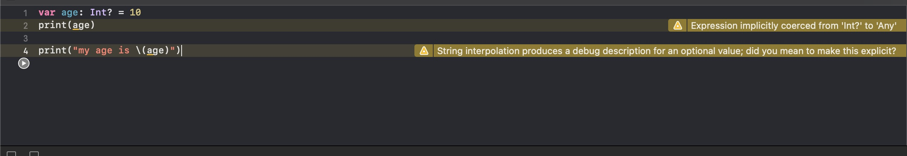
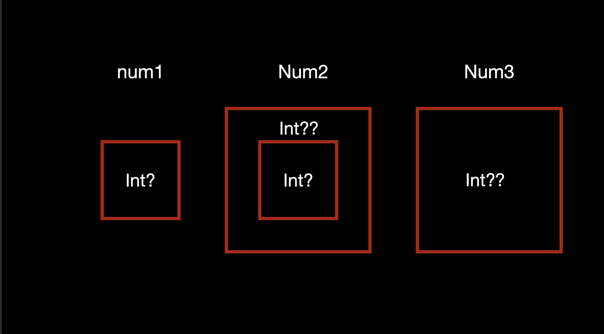

# 隐式解包

+ 在某些情况下，可选项一旦被设定值之后，就会一直拥有值
+ 在这种情况下，可以去掉检查，也不必每次访问的时候进行解包，因为它能确定每次访问的时候都有值
+ 可以在类后面加个感叹号!定义一个隐式解包可选项

``` swift

let num1: Int! = 10
let num2: Int = num1
if num1 != nil {
    print(num1 + 6) //  16
}

if let num3 = num1 {
    print(num3)
}

```

注意点：

隐式解包后，赋值为nil，在调用时会报错。

``` swift

var num1: Int! = nil

num1 + 10
num1 * 10

```

报错内容为：

``` 
Unexpectedly found nil while implicitly unwrapping an Optional value
```

大致意思为：意外的发现隐式解包的值为nil。

## 字符串插值

可选项在字符串插值或者直接打印时，编译器会发出警告

``` swift

var age: Int? = 10
print(age)
print("my age is \(age)")

```

警告如下图所示



第一行警告：

```
Expression implicitly coerced from 'Int?' to 'Any'
```

大致意思为：表达式隐式强制从"Int"转换到"Any"

第二行警告：

```
String interpolation produces a debug description for an optional value; did you mean to make this explicit?
```

大致意思为：

字符串插值生成一个可选值的调试描述，你明确这一点吗？

### 消除警告的三种方法

``` swift
print("My age is \(age!)")
```

``` swift
print("My age is \(String(describing: age))")
```

``` swift
print("My age is \(age ?? 0)")
```

## 多重可选项

``` swift

var num1: Int? = nil
var num2: Int?? = num1
var num3: Int?? = nil

(num2 ?? 1) ?? 2 //  2
(num3 ?? 1) ?? 2 //  1

```

可选项是对其他类型的一层包装，可以将它理解为一个盒子。所以我们用做图来理解。



如上图所示, num1为Int的可选值，num2为int的可选值的可选值等于num1，num3为int的可选值的可选值为nil。

``` num2: Int?? = num1```执行后拆解外面的大盒子，返回一个小盒子。因为小盒子是有值的，Int?类型的nil。

所以``` num2 ?? 1 ```返回的是 Int?类型的nil。 ``` Int?类型的nil ?? 2```这个时候拆包小盒子为nil 所以返回值为2.

因为num3为空的大盒子，所以就是nil。返回1，因为第一个选项不为nil，所以直接返回1。

