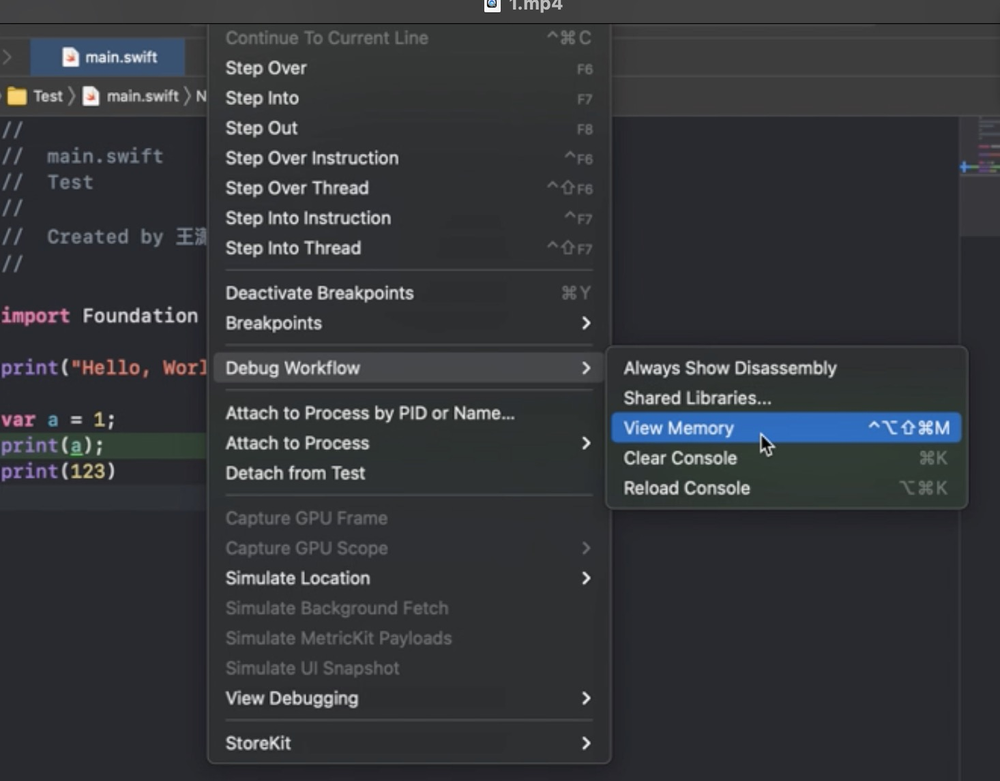

# 思考下面枚举变量的内存布局

``` swift

enum TestEnum {
    case test1(Int, Int, Int)
    case test2(Int, Int)
    case test3(Int)
    case test4(Bool)
    case test5
}

//  1个字节存储成员值
//  N个字节存储关联值(N取占用内存最大的关联值), 任何一个case的关联值都共用这N个字节
//  共用体

//  01 00 00 00 00 00 00 00
//  02 00 00 00 00 00 00 00
//  03 00 00 00 00 00 00 00
//  00
//  00 00 00 00 00 00 00

var e = TestEnum.test1(1, 2, 3)

//  04 00 00 00 00 00 00 00
//  05 00 00 00 00 00 00 00
//  00 00 00 00 00 00 00 00
//  01
//  00 00 00 00 00 00 00

e = .test2(4, 5)

//  06 00 00 00 00 00 00 00
//  00 00 00 00 00 00 00 00
//  00 00 00 00 00 00 00 00
//  02
//  00 00 00 00 00 00 00

e = .test3(6)

//  01 00 00 00 00 00 00 00
//  00 00 00 00 00 00 00 00
//  00 00 00 00 00 00 00 00
//  03
//  00 00 00 00 00 00 00

e = .test4(true)

//  00 00 00 00 00 00 00 00
//  00 00 00 00 00 00 00 00
//  00 00 00 00 00 00 00 00
//  04
//  00 00 00 00 00 00 00

e = .test5

//  小端：高高低低
print(MemoryLayout<TestEnum>.size) //  25
print(MemoryLayout<TestEnum>.stride) //  8
print(MemoryLayout<TestEnum>.alignment) //  32

```

** xCode中查看内存的方式 **

+ 方式一：Debug -> Debug Workflow -> View Memory
+ 方式二：断点后，右键 View Memory of ""


## switch底层

打开汇编查看模式

Debug -> Debug Workflow -> Always Show Disassembly



