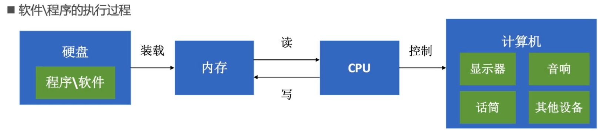
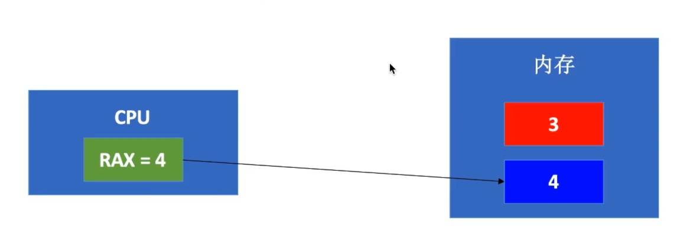

# 汇编语言

## 程序的本质

软件\程序的执行过程



## 寄存器与内存

CPU会先将内存中的数据存储到寄存器中，然后再对寄存器中的数据进行运算。

``` swift

var a = 3;
var b = a + 1;

```



+ CPU首先会将红色内存空间的值放到rax寄存器中:movq 红色内存空间, %rax
+ 然后让rax寄存器与1相加:addq $0x1, %rax
+ 最后将值赋值给内存空间:movq %rax, 蓝色内存空间