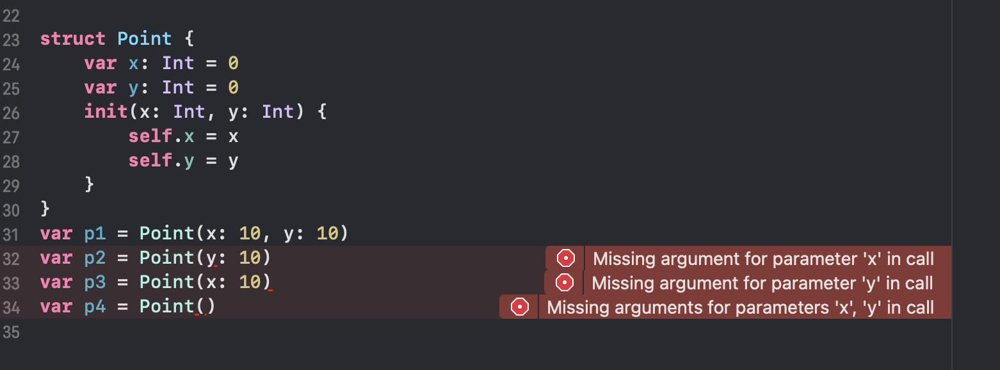
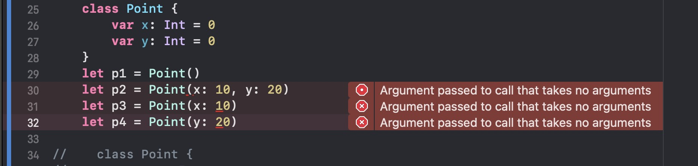
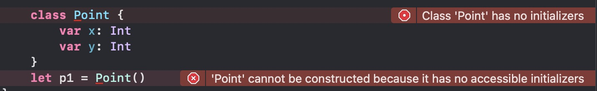
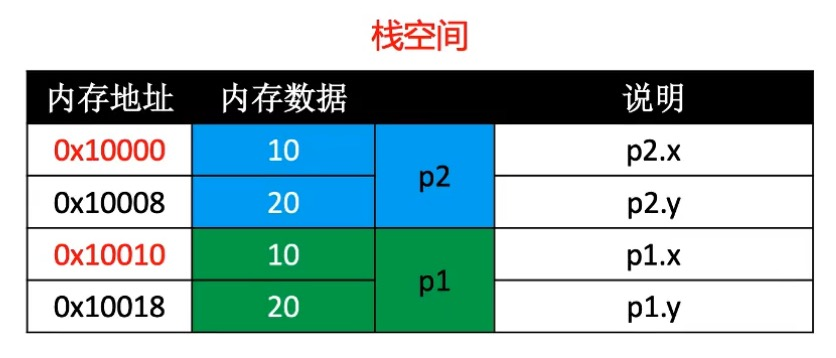
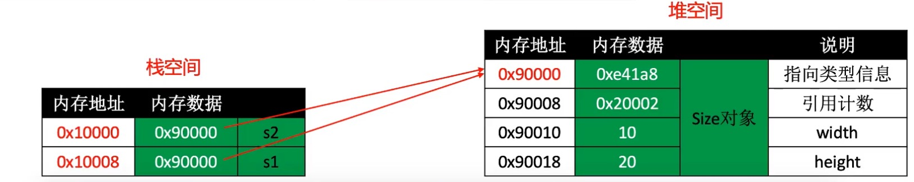

# 汇编分析结构体、类的内存布局

## 结构体

在swift标准库中，绝大多数的公开类型都是结构体，而枚举和类占很小一部分

+ 比如Bool、Int、Double、String、Array、Dictionary等常见类型都是结构体

``` swift

struct Date {
	var year: Int
	var month: Int
	var day: Int
}
var date = Date(year: 2019, month: 6, day: 23)

```

所有结构体都有一个编译器自动生成的初始化器(initializer, 初始化方法、构造器、构造方法)
在第6行调用的，可以传入所有成员值，用以初始化所有成员(存储属性，stored Property)

## 结构体的初始化器

编译器会根据情况，可能会为结构体生成多个初始化器，宗旨是：保证所有成员都有初始值

``` swift

struct Point {
	var x: Int
	var y: Int
}

var p1 = Point(x: 10, y: 10)
var p2 = Point(y: 10)
var p3 = Point(x: 10)
var p4 = Point()

```

一旦在定义结构体时自定义了初始化器，编译器就不会再帮它自动生成其他初始化器

``` swift

struct Point {
    var x: Int = 0
    var y: Int = 0
    init(x: Int, y: Int) {
        self.x = x
        self.y = y
    }
}
var p1 = Point(x: 10, y: 10)
var p2 = Point(y: 10)
var p3 = Point(x: 10)
var p4 = Point()

```



报错内容

```

Missing argument for parameter 'x' in call
Missing argument for parameter 'y' in call
Missing arguments for parameters 'x', 'y' in call

```

大致意思为：在调用时候缺少x参数、缺少y参数。

## 类

类的定义和结构体类似,但编译器并没有为类自动生成可以传入成员值的初始化器

情况一：参数有默认的初始值

``` swift

class Point {
    var x: Int = 0
    var y: Int = 0
}
let p1 = Point()
let p2 = Point(x: 10, y: 20)
let p3 = Point(x: 10)
let p4 = Point(y: 20)

```

以上代码会报错，报错如下图所示:



```
Argument passed to call that takes no arguments
```

大致意思为：传递给不带参数的call的参数。

情况二：参数没有默认的初始值

``` swift

class Point {
    var x: Int
    var y: Int
}
let p1 = Point()

```

以上代码会报错，报错如下图所示:



```
1. Class 'Point' has no initializers
2. 'Point' cannot be constructed because it has no accessible initializers
```

大致意思为：1. Point类没有构造器 2.Point不能构造，因为它没有任何可访问的初始化式。

## 类的初始化器

如果类的所有成员都在定义的时候指定了初始值，编译器会为类生成无参的初始化器
成员的初始化器是在这个初始化器中完成的

``` swift

class Point {
	var x: Int = 10
	var y: Int = 20
}
let p1 = Point()

class Point {
	var x: Int
	var y: Int
	init() {
		x = 10
		y = 20
	}
}
let p1 = Point()

```

上面2段代码是完全等效的

## 结构体和类的本质区别

+ 结构体是值类型(枚举也是值类型),类是引用类型(指针类型)

``` swift

class Size {
	var width = 1
	var height = 2
}

struct Point {
	var x = 3
	var y = 4
}

func test() {
	var size = Size()
	var point = Point()
}

```

## 值类型

+ 值类型赋值给var、let或者给函数传参，是直接将所有内容拷贝一份
+ 类似于对文件进行copy、paste操作，产生了全新的文件副本。属于深拷贝(deep copy)

``` swift

struct Point {
	var x: Int
	var y: Int
}

func test() {
	var p1 = Point(x: 10, y: 20)
	var p2 = p1
}

```



## 值类型赋值操作

``` swift

var s1 = "Jack"
var s2 = s1
s2.append("_Rose")
print(s1)
print(s2)

```

``` swift

var a1 = [1, 2, 3]
var a2 = a1
a2.append(4)
a1[0] = 2
print(a1)
print(a2)

```

``` swift

var d1 = ["max" : 10, "min" : 2]
var d2 = d1
d1["other"] = 7
d2["max"] = 12
print(d1)
print(d2)

```

+ 在swift标准库中，为了提升性能，String、Array、Dictionary、Set采取了Copy On Write技术
+ 比如仅当有"写"操作时，才会真正执行拷贝操作
+ 对于标准库值类型的赋值操作，Swift能确保最佳性能，所有没必要为了保证最佳性能来避免赋值。
+ 建议：不需要修改的，尽量定义成let

## 引用类型

+ 引用赋值给var、let或者给函数传参，是将内存地址拷贝一份
+ 类似于制作一个文件的替身(快捷方式、链接)，指向的是同一个文件。属于浅拷贝(shallow copy)

``` swift

class Size {
    var width: Int
    var height: Int
    init(width: Int, height: Int) {
        self.width = width
        self.height = height
    }
}

func test() {
    var s1 = Size(width: 10, height: 20)
    var s2 = s1
}

s2.width = 11
s2.height = 22
//	请问s1.width和s1.height是多少?
//	s1.width = 11 , s1.height = 22;

```

