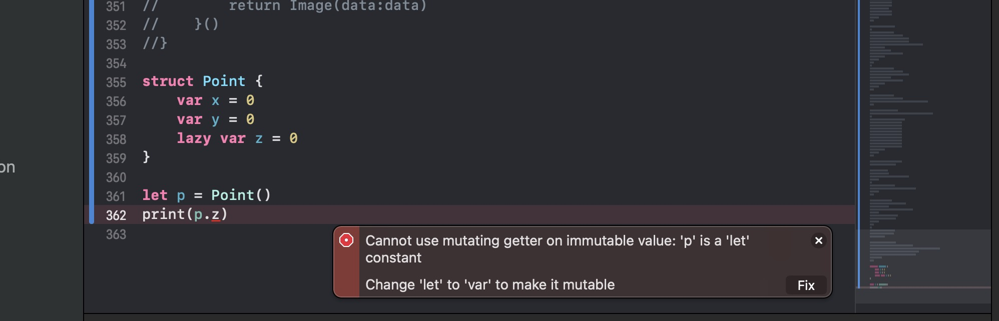

# 延迟存储属性(Lazy Stored Property)

+ 使用lazy可以定义一个延迟存储属性，在第一次用到属性的时候才会进行初始化

``` swift

class Car {
    init() {
        print("Car init!")
    }
    
    func run() {
        print("Car is running")
    }
}

class Person {
    lazy var car = Car()
    init() {
        print("Person init!")
    }
    func goOut() {
        car.run()
    }
}

let p = Person()
print("------")
p.goOut()

class PhotoView {
    lazy var image: Image = {
        let url = "htpps://www.baidu.com/xx.png"
        let data = Data(url: url)
        return Image(data:data)
    }()
}

```

+ lazy属性必须是var，不能是let
+ let必须在实例的初始化方法完成之前就拥有值

## 延迟存储属性注意点

+ 当结构体包含一个延迟存储属性时，只有var才能访问延迟存储属性
+ 因为延迟属性初始化时需要改变结构体的内存

``` swift

struct Point {
	var x = 0
	var y = 0
	lazy let z = 0
}

let p = Point()
print(p.z)

```

像以上代码 ``` let p = Point() ``` 这一行会报错。



大致意思为：不能对不可变值使用可变getter: 'p'是'let'常量。