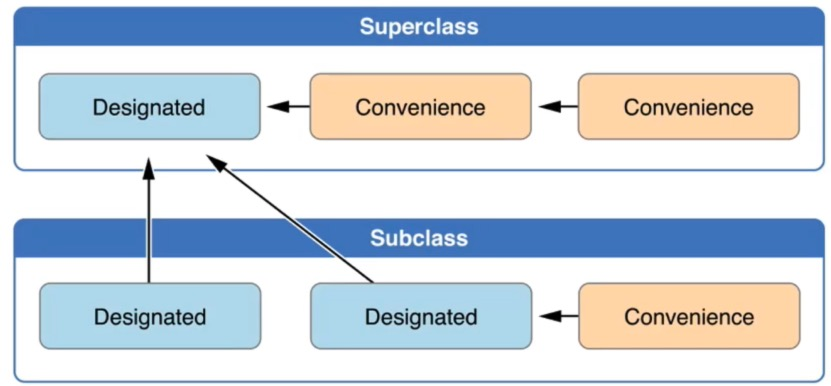

# 初始化

## 初始化器

类、结构体、枚举都可以定义初始化器

+ 类有2种初始化器:指定初始化器(designated initializer)、便捷初始化器(convenience initializer)

``` swift

//  指定初始化器
init(parameters) {
    statements
}

//  便捷初始化器
convenience init(parameters) {
    statements
}

```

+ 每个类至少有一个指定初始化器，指定初始化器是类的主要初始化器
+ 默认初始化器总是类的指定初始化器
+ 类偏向于少量指定初始化器，一个类通常只有一个指定初始化器

+ 初始化器的相互调用规则
	+ 指定初始化器必须从它的直系父类调用指定初始化器
	+ 便捷初始化器必须从相同的类里调用另一个初始化器
	+ 便捷初始化器最终必须调用一个指定初始化器

``` swift

class Size {
    var width: Int
    var height: Int
    //  指定初始化器(主要初始化器)
    init(width: Int, height: Int) {
        self.width = width
        self.height = height
    }
    convenience init(width: Int) {
        self.init(width: width, height: 0)
    }
    convenience init(height: Int) {
        self.init(width: 0, height: height)
    }
    convenience init() {
        self.init(width: 0, height: 0)
    }
}

var s1 = Size()
var s2 = Size(width: 10, height: 20)
var s3 = Size(width: 10)
var s4 = Size(height: 20)

```

``` swift

class Person {
    var age: Int
    init(age: Int) {
        self.age = age
    }
    convenience init() {
        self.init(age: 0)
    }
}

class Student: Person {
    var score: Int
    init(age: Int, score: Int) {
        self.score = score
        
        super.init(age: age)
    }
    
    convenience init() {
        self.init(age: 0, score: 0)
    }
    
    convenience init(score: Int) {
        self.init(age: 0, score: score)
    }
}

```

## 初始化器的相互调用



这一套规则保证了
+ 使用任意初始化器，都可以完整地初始化实例

## 两段式初始化

Swift在编码安全方面是煞费苦心，为了保证初始化过程的安全，设定了两段式初始化、安全检查

**两段式初始化**

+ 第1阶段：初始化所有存储属性
	+ 外层调用指定\便捷初始化器
	+ 分配内存给实例，但未初始化
	+ 指定初始化器确保当前类定义的存储属性都初始化
	+ 指定初始化器调用父类的初始化器，不断向上调用，形成初始化器链

+ 第2阶段：设置新的存储属性值
	+ 从顶部初始化器往下，链中的每一个指定初始化器都有机会进一步定制实例
	+ 初始化器现在能够使用self(访问、修改它的属性，调用它的实例方法等等)
	+ 最终，链中任何便捷初始化器都有机会定制实例以及使用self


``` swift

class Person {
    var age: Int
    init(age: Int) {
        self.age = age
    }
    convenience init() {
        self.init(age: 0)
    }
}

class Student: Person {
    var score: Int
    init(age: Int, score: Int) {
        self.score = score

        super.init(age: age)
    }

    convenience init() {
        self.init(age: 0, score: 0)
    }

    convenience init(score: Int) {
        self.init(age: 0, score: score)
    }
}


var stu1 = Student()

```

## 安全检查

+ 指定初始化器必须保证在调用父类初始化器之前，其所在类定义的所有存储属性都要初始化完成
+ 指定初始化器必须先调用父类初始化器，然后才能为继承的属性设置新值
+ 便捷初始化器必须先调用同类中的其它初始化器，然后再为任意属性设置新值
+ 初始化器在第1阶段初始化完成之前，不能调用任何实例方法、不能读取任何实例属性的值，也不能引用self
+ 直到第1阶段结束，实例才算完全合法

## 重写

+ 当重写父类的指定初始化器时，必须加上override(即使子类的实现是便捷初始化器)
+ 如果子类写了一个匹配分类便捷初始化器的初始化器，不用加上override
	+ 因为父类的便捷初始化器永远不会通过子类直接调用，因此，严格来说，子类无法重写父类的便捷初始化器

``` swift

class Person {
    var age: Int
    init(age: Int) {
        self.age = age
    }
    convenience init() {
        self.init(age: 0)
    }
}

class Student: Person {
    var score: Int
    init(age: Int, score: Int) {
        self.score = score
        super.init(age: age)
    }

    init() {
        self.score = 0
        super.init(age: 0)
    }
}


var stu1 = Student()

```

## 自动继承

+ 如果子类没有定义任何指定初始化器，它会自动继承父类所有的指定初始化器

``` swift

class Person {
    var age: Int
    var name: String
    init(age: Int, name: String) {
        self.age = age
        self.name = name
    }
    init(age: Int) {
        self.age = age
        self.name = ""
    }
}

class Student: Person {
    
}

var stu1 = Student(age: 10)
var stu2 = Student(age: 10, name: "Jack")

```

+ 如果子类提供了父类所有指定初始化器的实现（要么通过方式①继承，要么重写）
	+ 子类自动继承所有的父类便捷初始化器

``` swift

class Person {
    var age: Int
    var name: String
    init(age: Int, name: String) {
        self.age = age
        self.name = name
    }
    init() {
        self.age = 0
        self.name = ""
    }
    convenience init(age: Int) {
        self.init(age: age, name: "")
    }
    convenience init(name: String) {
        self.init(age: 0, name: name)
    }
}

class Student: Person {
    override init(age: Int, name: String) {
        super.init(age: age, name: name)
    }
    override init() {
        super.init(age: 0, name: "")
    }
}

var stu1 = Student(age: 10)
var stu2 = Student(age: 10, name: "Jack")

```

+ 就算子类添加了更多的便捷初始化器，这些规则仍然适用

+ 子类以便捷初始化器的形式重写父类的指定初始化器，也可以作为满足规则的②的一部分