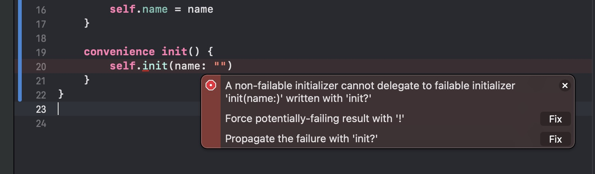

# 可失败初始化器

+ 类、结构体、枚举都可以使用init?定义可失败初始化器

``` swift

class Person {
    var name: String
    init?(name: String) {
        if name.isEmpty {
            return nil
        }
        self.name = name
    }
}

```

+ 之前接触过的可失败初始化器

``` swift

var num = Int("123")
public init?(_ description: String)

```

``` swift

enum Answer: Int {
    case wrong, right
}
var an = Answer(rawValue: 1)

```

+ 不允许同时定义参数标签、参数个数、参数类型相同的可失败初始化器和非可失败初始化器
+ 可以用```init!```定义隐式解包的可失败初始化器
+ 可失败初始化器可以调用非可失败初始化器，非可失败初始化器调用可失败初始化器需要进行解包

``` swift

class Person {
    var name: String
    convenience init?(name: String) {
        self.init()
        
        if name.isEmpty {
            return nil
        }
    }
    
    init() {
        self.name = ""
    }
}

var p1 = Person(name: "")
print(p1)

var p2 = Person(name: "Jack")
print(p2)

```

如果反过来，则会报错

``` swift

class Person {
    var name: String
    init?(name: String) {
        if name.isEmpty {
            return nil
        }
        self.name = name
    }
    
    convenience init() {
        self.init(name: "")
    }
}

```



报错为：```A non-failable initializer cannot delegate to failable initializer 'init(name:)' written with 'init?'```

大致意思为：一个不可失败的初始化器不可以委托给可失败初始化器，需要使用```init?```

+ 如果初始化器调用一个可失败初始化器导致初始化失败，那么整个初始化过程都失败，并且之后的代码都停止执行

``` swift

class Person {
    var name: String
    init?(name: String) {
        if name.isEmpty {
            return nil
        }
        self.name = name
    }
    convenience init?() {
        self.init(name: "")
        self.name = "Jack"
        //  ...
    }
}

var p1 = Person()

```

+ 可以用一个非可失败初始化器重写一个可失败初始化器，但反过来是不行的

``` swift

class Person {
    var name: String
    init?(name: String) {
        if name.isEmpty {
            return nil
        }
        self.name = name
    }
    convenience init?() {
        self.init(name: "")
        self.name = "Jack"
        //  ...
    }
}

class Student: Person {
    override init?(name: String) {
        super.init(name: "")
    }
}

```